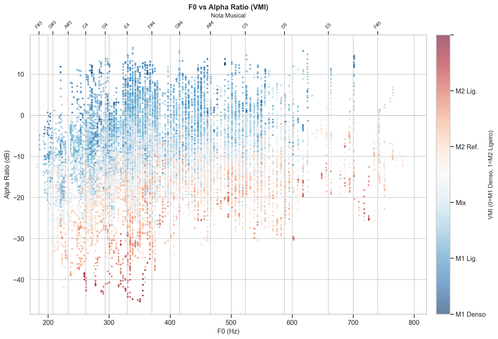

# Metodologia Computacional - Análise Bioacústica de Mecanismos Laríngeos

**Versão:** 2.0
**Data:** 2026-02-09
**Contexto:** Análise computacional para artigo acadêmico sobre classificação vocal "Fach" no Choro

> **Novo ao tema?** Leia primeiro o [glossário bioacústico](GLOSSARIO_BIOACUSTICO.md) — explica os conceitos e a lógica da análise de forma acessível, sem jargão técnico.

---

## 1. Contexto e Objetivos

Este documento descreve a metodologia computacional implementada para a análise fisiológica de mecanismos laríngeos (M1/M2) em gravações de canto do gênero Choro. O objetivo é fornecer evidências quantitativas que desafiem o sistema tradicional de classificação vocal "Fach", demonstrando através de features bioacústicas explicáveis que cantores utilizam ambos os mecanismos de forma fluida.

### 1.1 Mecanismos Laríngeos

- **M1 (Mecanismo 1)**: Voz de peito/modal. Características: maior massa das pregas vocais, maior energia espectral em harmônicos baixos, HNR tipicamente elevado.
- **M2 (Mecanismo 2)**: Voz de cabeça/falsete. Características: menor massa vibratória, energia concentrada em harmônicos altos, transições de fase características.

### 1.2 Desafio Técnico

Gravações históricas do Choro (décadas de 1940-1960) apresentam:
- Ruído de fundo elevado
- Baixa razão sinal-ruído (SNR)
- Vibrato intenso e ornamentações rápidas (glissandi, portamenti)
- Qualidade espectral degradada

Essas características exigem métodos robustos de extração de pitch e features de qualidade vocal.

### 1.3 Generalização para Outros Gêneros

Embora desenvolvido para o Choro, este pipeline é **agnóstico ao gênero musical** e pode ser aplicado a qualquer repertório vocal solo: ópera, MPB, fado, jazz vocal, música sacra, etc. A arquitetura modular (separação de fonte → extração de features → classificação de mecanismo) é reutilizável sem alteração estrutural.

**Adaptações necessárias por gênero:**

| Parâmetro | Choro (atual) | Adaptação sugerida |
|-----------|---------------|--------------------|
| `fmin` / `fmax` | 50-800 Hz | Ajustar conforme tessitura (ex: baixo operático: 50-400 Hz; soprano: 200-1200 Hz) |
| Source separation | HTDemucs (arranjo misto) | Desnecessário para voz *a cappella*; essencial para arranjos orquestrais |
| Threshold M1/M2 | 400 Hz (~G4, vozes femininas) | Ajustar por tessitura (ex: ~300 Hz para vozes masculinas) |
| VMI | Pesos fixos | Os pesos espectrais (alpha ratio, H1-H2, spectral tilt) são independentes de tessitura por construção |

O VMI (seção 6.1, Método 4) é particularmente portátil, pois classifica mecanismos com base em features espectrais e não em thresholds de frequência absoluta.

---

## 2. Pipeline de Processamento

### 2.1 Pré-processamento de Áudio

**Módulo:** `src/vocal_analysis/preprocessing/audio.py`

```python
load_audio(audio_path, sr=44100, mono=True, normalize=True, target_db=-3.0)
```

#### Parâmetros Críticos

| Parâmetro | Valor | Justificativa |
|-----------|-------|---------------|
| **Sample Rate** | 44.1 kHz | Padrão CD quality, suporta fmax até 22.05 kHz |
| **Mono** | True | Voz humana é fonte pontual, stereo desnecessário |
| **Normalização** | -3 dBFS | Padroniza amplitude entre gravações, evita clipping |

**Implementação da Normalização:**
```python
target_amplitude = 10 ** (target_db / 20)  # -3dB = 0.708 em amplitude linear
audio_normalized = audio * (target_amplitude / max(abs(audio)))
```

### 2.2 Source Separation (HTDemucs)

**Módulo:** `src/vocal_analysis/preprocessing/separation.py`

Em arranjos complexos de Choro (violão 7 cordas, cavaquinho, pandeiro, flauta), a detecção de pitch pode captar instrumentos ao invés da voz. A separação de fonte vocal via HTDemucs é **habilitada por padrão** desde a v2.0, pois melhora significativamente a detecção de pitch em arranjos densos. Para desabilitá-la (ex: gravações *a cappella*), use `--no-separate-vocals`.

#### Por que HTDemucs?

| Aspecto | HTDemucs | Spleeter |
|---------|----------|----------|
| **Arquitetura** | Híbrida (tempo + frequência) com Transformer | U-Net simples |
| **SDR em vocals** | 7-9 dB | 5-6 dB |
| **Qualidade em arranjos densos** | ✅ Excelente | ⚠️ Artefatos em instrumentos sobrepostos |
| **Integração PyTorch** | ✅ Via torchaudio.pipelines | ❌ Requer pacote separado |

**Referência:** Défossez, A., et al. (2021). Hybrid Spectrogram and Waveform Source Separation. *ISMIR*.

#### Implementação

```python
from vocal_analysis.preprocessing.separation import separate_vocals

# Separar voz (com cache automático)
vocals, sr = separate_vocals(
    audio_path,
    device="cuda",           # ou "cpu"
    cache_dir=Path("data/cache/separated")
)
# vocals: np.ndarray mono, sr: 44100 Hz
```

#### Fluxo com Separação

```
Áudio MP3 → HTDemucs (separar voz) → WAV temporário → CREPE + Praat → Features
                ↓
         Cache .npy (evita reprocessamento)
```

#### Validação Visual

Para confirmar que a separação está captando a voz (e não o cavaquinho), o pipeline gera plots comparativos com `--validate-separation`:

- Eixo Y esquerdo: Frequência (Hz)
- Eixo Y direito: Notas musicais (A#4, C5, etc.)
- Coloração: Confiança CREPE (0-1)

Se a melodia após separação for mais contínua e nas notas esperadas para voz feminina (~200-600 Hz), a separação está funcionando.

#### Flags CLI

```bash
--no-separate-vocals       # Desabilitar source separation (não recomendado para arranjos complexos)
--separation-device        # cpu ou cuda (default: mesmo que --device)
--no-separation-cache      # Forçar reprocessamento
--validate-separation      # Gerar plot comparativo Hz + notas
```

**Nota:** A separação é habilitada por padrão. Não é necessário passar `--separate-vocals`.

### 2.3 Extração de Features Híbrida (Crepe + Praat)

**Módulo:** `src/vocal_analysis/features/extraction.py`

O pipeline combina:
1. **CREPE (CNN)** para extração robusta de f0
2. **Praat/Parselmouth** para features espectrais (gold standard em análise vocal)

---

## 3. Extração de Frequência Fundamental (f0)

### 3.1 Escolha do CREPE

**Método:** Convolutional Neural Network treinada em dados de pitch anotados
**Referência:** Kim et al. (2018) - "CREPE: A Convolutional Representation for Pitch Estimation"

#### Por que CREPE ao invés de Autocorrelação (Praat)?

| Aspecto | CREPE (CNN) | Praat (Autocorrelação) |
|---------|-------------|------------------------|
| **Vibrato intenso** | ✅ Robusto | ⚠️ Pode confundir com subharmônicos |
| **Ruído de fundo** | ✅ Aprende a ignorar | ❌ Degrada picos de autocorrelação |
| **Ornamentações rápidas** | ✅ Alta resolução temporal | ⚠️ Depende de janelamento |
| **Gravações históricas** | ✅ Generaliza para baixa SNR | ❌ Requer SNR > 20dB |

**Implementação:**
```python
f0, confidence = torchcrepe.predict(
    audio_tensor,
    sample_rate=44100,
    hop_length=220,        # 5ms @ 44.1kHz — captar ornamentos rápidos
    fmin=50.0,             # ~G1 (limite inferior voz humana)
    fmax=800.0,            # ~G5 (cobre M1 e M2)
    model='full',          # Precisão máxima para contexto acadêmico
    decoder=torchcrepe.decode.weighted_argmax,  # Preserva notas agudas reais
    return_periodicity=True
)
```

### 3.2 Parâmetros Temporais

| Parâmetro | Valor | Justificativa |
|-----------|-------|---------------|
| **hop_length** | 220 samples (5ms) | Resolução alta para captar ornamentos rápidos do Choro (glissandi, portamenti) |
| **model** | `full` | Precisão máxima; modelo `tiny` apresentava erros em transições M1↔M2 |
| **decoder** | `weighted_argmax` | Preserva notas agudas reais em M2; `viterbi` tende a suavizar excessivamente, "engolindo" picos |
| **Janelamento CREPE** | ~25ms (interno) | Não configurável, otimizado pela arquitetura CNN |
| **Filtragem** | fmin/fmax + periodicity | Frames com f0 fora de [50, 800] Hz são descartados; confiança baseada em periodicidade (não threshold fixo) |

**Nota sobre decoder:** O `weighted_argmax` pode gerar mais variância instantânea que o `viterbi`, mas preserva melhor as transições rápidas de registro e as notas agudas em M2 — essenciais para análise de mecanismos laríngeos.

**Nota sobre janelamento:** O CREPE utiliza internamente janelamento próprio (~25ms) que não é configurável pelo usuário. Essa escolha arquitetural foi validada em benchmarks MIR e supera métodos baseados em autocorrelação.

---

## 4. Features de Qualidade Vocal (Praat/Parselmouth)

### 4.1 Harmonicity-to-Noise Ratio (HNR)

**Definição:** Razão entre energia harmônica e energia de ruído (dB)
**Interpretação:**
- HNR > 15 dB → Voz "limpa", fechamento glótico eficiente (típico M1)
- HNR < 10 dB → Soprosidade, ruído aspirativo (típico M2 ou patologias)

**Extração:**
```python
harmonicity = sound.to_harmonicity(time_step=0.005)  # 5ms (= hop_length/sr)
hnr_values = harmonicity.values[0]  # Array temporal
```

### 4.2 Cepstral Peak Prominence Smoothed (CPPS)

**Definição:** Proeminência do pico cepstral suavizado, proxy para regularidade de vibração das pregas vocais
**Aplicação:** Diferenciação de fonação modal (M1) vs soprosidade (M2)

**Extração:**
```python
power_cepstrogram = parselmouth.praat.call(sound, "To PowerCepstrogram", fmin, time_step, 5000, 50)
cpps = parselmouth.praat.call(power_cepstrogram, "Get CPPS", ...)
```

**Limitação:** Gravações com ruído de fundo elevado comprometem a medida. Fallback para HNR médio quando extração falha.

**Nota sobre soprosidade em M1:** É possível produzir sons com soprosidade em M1 (ex: fonação soprada intencional, *voix soufflée*). Nosso modelo trata HNR e CPPS baixos como **indicadores probabilísticos**, não determinísticos, de M2. O modelo é aproximativo e perfectível — a correlação CPPS baixo → M2 é uma tendência estatística, não uma regra absoluta.

### 4.3 Jitter (ppq5) e Shimmer (apq11)

**Jitter (Period Perturbation Quotient):**
Mede instabilidade da frequência de vibração glótica entre 5 períodos consecutivos.

**Shimmer (Amplitude Perturbation Quotient):**
Mede variação de amplitude entre 11 períodos consecutivos.

**Interpretação:**
- Valores baixos (jitter < 1%, shimmer < 3%) → Fonação estável
- Valores altos → Vibrato, patologia, ou transição de registro

**Extração:**
```python
point_process = parselmouth.praat.call(sound, "To PointProcess (periodic, cc)", fmin, fmax)
jitter_ppq5 = parselmouth.praat.call(point_process, "Get jitter (ppq5)", 0, 0, 0.0001, 0.02, 1.3)
shimmer_apq11 = parselmouth.praat.call([sound, point_process], "Get shimmer (apq11)", 0, 0, 0.0001, 0.02, 1.3, 1.6)
```

### 4.4 Energia Espectral (RMS)

**Definição:** Root Mean Square da amplitude, proxy para intensidade vocal.

**Aplicação:** Feature essencial para o classificador XGBoost (M1 tipicamente mais energético que M2).

**Extração:**
```python
energy = librosa.feature.rms(y=audio, frame_length=int(0.025 * sr), hop_length=220)[0]
```

### 4.5 Formantes F1-F4

**Definição:** Ressonâncias do trato vocal extraídas via Linear Predictive Coding (método de Burg).

**Aplicação:**
- Detectar aproximação de formantes ("zona de fala")
- Diferenciar timbres de M1 vs M2
- Identificar estratégias de ressonância (*vowel tuning*)

**Exemplo prático:** Em M1, F1 tipicamente se situa acima de f0, permitindo ressonância livre do 1º harmônico. No passaggio, f0 se aproxima de F1, e cantores treinados ajustam o formato do trato vocal (*vowel tuning* / *formant tuning*) para manter eficiência acústica — por exemplo, abrindo mais a mandíbula para elevar F1 e mantê-lo acima de f0 (Bozeman, 2013). Essa estratégia é comum tanto em M1 agudo quanto na transição para M2.

**Referências:**
- Bozeman, K. W. (2013). *Practical Vocal Acoustics.* Pendragon Press.
- Bozeman, K. W. (2017). *Kinesthetic Voice Pedagogy.* Inside View Press.
- Sundberg, J. (1987). *The Science of the Singing Voice.* Northern Illinois University Press.

**Extração:**
```python
formants = sound.to_formant_burg(time_step=0.005, max_number_of_formants=5, maximum_formant=5500)
f1 = formants.get_value_at_time(1, time)
f2 = formants.get_value_at_time(2, time)
# ... F3, F4
```

### 4.6 Features Espectrais para VMI

**Módulo:** `src/vocal_analysis/features/spectral.py`

Estas features são usadas para calcular o **VMI (Vocal Mechanism Index)**, permitindo classificação de mecanismo independente da tessitura. Todas são extraídas com `hop_length=220` (5ms), alinhadas temporalmente com o f0 do CREPE.

**Resumo das features espectrais:**

| Feature | O que mede | M1 (peito) | M2 (cabeça) | Referência principal |
|---------|-----------|------------|-------------|---------------------|
| **Alpha Ratio** | Distribuição de energia: graves vs agudos | Alta (mais energia em agudos) | Baixa (energia nos graves) | Sundberg & Nordenberg (2006) |
| **H1-H2** | Padrão de adução glótica | Baixo (adução firme) | Alto (adução leve) | Hanson (1997) |
| **Spectral Tilt** | Velocidade de decaimento espectral | Íngreme (negativo) | Raso (próx. de zero) | Fant (1995); Gauffin & Sundberg (1989) |
| **CPPS per-frame** | Periodicidade da vibração | Alto (periódico) | Alto se bem produzido; baixo se soproso | Maryn & Weenink (2015) |

---

#### 4.6.1 Alpha Ratio

**Definição:** Razão de energia espectral entre banda alta (1-5 kHz) e banda baixa (50 Hz-1 kHz), em dB.

**Referência:** Sundberg, J., & Nordenberg, M. (2006). Effects of vocal loudness variation on spectrum balance as reflected by the alpha measure of long-term-average spectra of speech. *J. Acoust. Soc. Am.*, 120(1), 453-457.

**Base física:** Em M1, o fechamento glótico é rápido e firme, gerando harmônicos superiores fortes (mais energia acima de 1 kHz). Em M2/falsete, o fechamento é suave, com energia concentrada no fundamental e primeiros harmônicos.

**Interpretação:**
- Alpha Ratio alta → mais energia em harmônicos superiores → típico de M1
- Alpha Ratio baixa → energia concentrada em graves → típico de M2/falsete

**Extração:**
```python
from vocal_analysis.features.spectral import compute_alpha_ratio
alpha_ratio = compute_alpha_ratio(audio, sr, hop_length=220, low_band=(50, 1000), high_band=(1000, 5000))
```

---

#### 4.6.2 H1-H2 (Diferença de Harmônicos)

**Definição:** Diferença de amplitude (dB) entre o 1º harmônico (H1 = f0) e o 2º harmônico (H2 = 2×f0).

**Referências:**
- Hanson, H. M. (1997). Glottal characteristics of female speakers: Acoustic correlates. *J. Acoust. Soc. Am.*, 101(1), 466-481.
- Kreiman, J., Gerratt, B. R., Garellek, M., Samlan, R., & Zhang, Z. (2014). Toward a unified theory of voice production and perception. *Loquens*, 1(1), e009.

**Base física:** H1-H2 é o correlato acústico mais direto do padrão de adução glótica. Uma adução firme (M1) produz um fechamento abrupto do fluxo de ar, gerando harmônicos fortes — H2 se aproxima de H1 em amplitude (H1-H2 baixo). Uma adução leve (M2) produz um fundamental dominante com harmônicos fracos (H1-H2 alto).

**Interpretação:**
- H1-H2 baixo → adução firme, inclinação glotal íngreme → M1
- H1-H2 alto → adução leve, inclinação glotal suave → M2

**Limitação:** Quando f0 > 350 Hz, H1 pode coincidir com F1 (primeira ressonância do trato vocal), contaminando a medida. Por isso, usamos Spectral Tilt como complemento.

**Extração:**
```python
from vocal_analysis.features.spectral import compute_h1_h2
h1_h2 = compute_h1_h2(audio, sr, f0, hop_length=220, n_fft=4096, harmonic_tolerance_hz=50.0)
```

---

#### 4.6.3 Spectral Tilt (Inclinação Espectral)

**Definição:** Inclinação da regressão linear ajustada ao espectro de potência (log-frequência vs amplitude em dB), na faixa de 50-5000 Hz.

**Referências:**
- Fant, G. (1995). The LF-model revisited: Transformations and frequency domain analysis. *STL-QPSR*, 2-3/1995, 119-156.
- Gauffin, J., & Sundberg, J. (1989). Spectral correlates of glottal voice source waveform characteristics. *J. Speech Hear. Res.*, 32(3), 556-565.

**Base física — explicação intuitiva:** A inclinação espectral mede a velocidade com que a energia vocal decai nas frequências altas. Funciona como um "controle de brilho" da voz:

- **Tilt íngreme (muito negativo):** A energia cai rapidamente com a frequência. Os graves dominam, os agudos são fracos. A voz soa "escura", "coberta". Fisicamente, isso ocorre quando as pregas vocais se fecham *lentamente e suavemente* (típico de M2/falsete): o pulso glotal é suave, sem descontinuidades bruscas, e portanto gera poucos harmônicos agudos.

- **Tilt raso (próximo de zero):** A energia se distribui mais uniformemente. Harmônicos agudos são relativamente fortes. A voz soa "brilhante", "projetada". Fisicamente, isso ocorre quando as pregas vocais se fecham *rápida e firmemente* (típico de M1/peito): o fechamento abrupto cria descontinuidades no fluxo de ar, que por sua vez geram harmônicos fortes em alta frequência (assim como uma onda quadrada tem mais overtones que uma senoide).

**Cadeia causal:** padrão de fechamento glótico → forma do pulso de ar → inclinação espectral.

**Vantagem sobre H1-H2:** O spectral tilt captura o padrão *global* de distribuição de energia, sem depender da detecção precisa de harmônicos individuais. É mais robusto em registro agudo (f0 > 350 Hz), onde H1-H2 se torna instável.

**Extração:**
```python
from vocal_analysis.features.spectral import compute_spectral_tilt
spectral_tilt = compute_spectral_tilt(audio, sr, hop_length=220, fmin=50.0, fmax=5000.0)
```

---

#### 4.6.4 CPPS per-frame

**Definição:** Proeminência do pico cepstral suavizada, calculada por frame (não global).

**Referência:** Maryn, Y., & Weenink, D. (2015). Objective dysphonia measures in the program Praat. *Journal of Voice*.

**Interpretação:**
- CPPS alto → voz periódica, limpa
- CPPS baixo → ruído, aperiodicidade

**Nota:** CPPS alto ocorre tanto em M1 denso quanto em M2 reforçado (*voix mixte*) — ambos são periódicos e limpos. CPPS baixo indica soprosidade ou quebra de voz, não um mecanismo específico. Por isso, no VMI, CPPS tem contribuição neutra (não discrimina fortemente M1/M2).

**Extração:**
```python
from vocal_analysis.features.spectral import compute_cpps_per_frame
cpps = compute_cpps_per_frame(audio_path, hop_length=220, window_duration=0.04)
```

---

#### 4.6.5 Mapeamento Features → VMI

| Configuração | Alpha Ratio | CPPS | H1-H2 | Spectral Tilt | VMI |
|--------------|-------------|------|-------|---------------|-----|
| **M1 Denso** | Alta | Alto | Baixo | Íngreme (negativo) | 0.0-0.2 |
| **M1 Ligeiro** | Moderada | Alto | Moderado | Moderado | 0.2-0.4 |
| **Passaggio/Mix** | Variável | Variável | Instável | Transição | 0.4-0.6 |
| **M2 Reforçado** | Moderada | Alto | Alto | Suave | 0.6-0.8 |
| **M2 Ligeiro** | Baixa | Moderado | Muito alto | Muito suave | 0.8-1.0 |

**Notas Teóricas:**

1. **CPPS Alto em M2 Reforçado:** Um M2 bem produzido (*voix mixte*) tem CPPS **alto** porque é periódico e limpo. CPPS baixo indica ruído/aperiodicidade, não ressonância reforçada.

2. **H1-H2 instável no passaggio:** Quando f0 > 350 Hz, H1 pode coincidir com F1, tornando H1-H2 menos confiável (Hanson, 1997). Por isso incluímos Spectral Tilt como feature complementar.

3. **F0-F1 não indica mecanismo:** A proximidade F0↔F1 é estratégia de ressonância (*vowel tuning*; Bozeman, 2013). Sopranos em M2 e tenores em M1 podem usar a mesma estratégia. Não usar diretamente no VMI.

---

## 5. Features de Agilidade Articulatória

**Módulo:** `src/vocal_analysis/features/articulation.py`

### 5.1 Velocidade de Mudança de Pitch (f0 velocity)

**Definição:** Taxa de mudança da frequência fundamental (Hz/s)

```python
f0_velocity = Δf0 / Δt
```

**Aplicação:** Quantificar ornamentações rápidas (glissandi, portamenti) características do Choro.

### 5.2 Aceleração de Pitch (f0 acceleration)

**Definição:** Taxa de mudança da velocidade de pitch (Hz/s²)

```python
f0_acceleration = Δ(f0_velocity) / Δt
```

**Aplicação:** Detectar transições abruptas de registro (quebras M1→M2).

### 5.3 Taxa Silábica

**Definição:** Estimativa de sílabas por segundo via detecção de picos de energia.

**Método:**
1. Encontrar picos locais no sinal de energia RMS
2. Aplicar distância mínima de 100ms entre picos (evitar dupla contagem)
3. Normalizar pelo tempo total

```python
from scipy.signal import find_peaks
peaks, _ = find_peaks(energy, distance=int(0.1 / time_step))
syllable_rate = len(peaks) / duration
```

**Aplicação:** Proxy para agilidade técnica do cantor.

---

## 6. Classificação de Mecanismos M1/M2

### 6.1 Abordagem Híbrida

O pipeline implementa **4 métodos complementares**:

#### Método 1: Threshold Heurístico
```python
mechanism = "M1" if f0 < 400 Hz else "M2"
```
**Justificativa:** 400 Hz (~G4) é limiar empírico de passaggio para vozes femininas.
**Limitação:** Ignora covariância com HNR/energia.

#### Método 2: Gaussian Mixture Model (GMM)
```python
from sklearn.mixture import GaussianMixture
from sklearn.preprocessing import RobustScaler

features = df_voiced[["f0", "hnr"]].values
scaler = RobustScaler()  # Usa mediana/IQR, robusto a outliers
features_norm = scaler.fit_transform(features)

gmm = GaussianMixture(n_components=2, random_state=42)
labels = gmm.fit_predict(features_norm)
```
**Vantagem:** Não-supervisionado, descobre clusters naturais.
**Normalização:** RobustScaler (mediana/IQR) em vez de StandardScaler (mean/std), mais robusto a outliers em gravações históricas.


#### Método 3: XGBoost (Supervisionado com Pseudo-Labels)
```python
import xgboost as xgb
# Usar labels do GMM como pseudo-labels
# Features base + formantes se disponíveis no CSV
X = (f0, HNR, energy, f0_velocity, f0_acceleration, f1, f2, f3, f4)
y = gmm_labels  # 0=M1, 1=M2
model = xgb.XGBClassifier(n_estimators=100, max_depth=5, learning_rate=0.1)
model.fit(X, y)
# Predição aplicada sobre todos os frames voiced
predictions = model.predict(X)
```

**Vantagem:** Aprende interações não-lineares entre features.
**Aplicação:** Classificação robusta para novos dados. Classification report salvo no relatório `outputs/analysis_report.md`.

**Justificativa teórica para pseudo-labeling:** O uso de labels gerados por um modelo não-supervisionado (GMM) para treinar um classificador supervisionado (XGBoost) é uma técnica estabelecida em aprendizado semi-supervisionado (Lee, 2013; Nigam et al., 2000). A ideia é que o GMM descobre a estrutura natural dos dados (clusters M1/M2 no espaço f0 × HNR), e o XGBoost aprende fronteiras de decisão mais complexas usando features adicionais (energia, formantes, velocidade de pitch).

**Caveats:**
1. **Viés de confirmação:** O XGBoost herda os erros do GMM — não pode ser *melhor* que seus pseudo-labels na média.
2. **Premissa gaussiana:** O GMM assume clusters gaussianos, o que pode não refletir a distribuição real dos mecanismos.
3. **Ausência de ground truth:** Sem validação laringoscópica ou por eletroglotografia (EGG), a acurácia real é desconhecida.

O VMI (Método 4) oferece uma abordagem complementar: baseado em teoria acústica e features espectrais, não depende de pseudo-labels.


#### Método 4: VMI (Vocal Mechanism Index) — Agnóstico à Tessitura

**Módulo:** `src/vocal_analysis/features/vmi.py`

O VMI é uma métrica contínua (0-1) que substitui o threshold arbitrário de G4 por análise baseada em **features espectrais**:

```python
from vocal_analysis.features.vmi import compute_vmi_fixed, vmi_to_label

vmi = compute_vmi_fixed(
    alpha_ratio=df["alpha_ratio"].values,
    cpps=df["cpps_per_frame"].values,
    h1_h2=df["h1_h2"].values,
    spectral_tilt=df["spectral_tilt"].values,
)
labels = vmi_to_label(vmi)  # M1_HEAVY, M1_LIGHT, MIX_PASSAGGIO, M2_REINFORCED, M2_LIGHT
```

**Escala VMI:**

| VMI | Label | Descrição |
|-----|-------|-----------|
| 0.0-0.2 | `M1_HEAVY` | Mecanismo pesado, adução firme, voz de peito plena |
| 0.2-0.4 | `M1_LIGHT` | M1 de borda fina, comum em tenores/registro médio |
| 0.4-0.6 | `MIX_PASSAGGIO` | Zona de passagem, instabilidade acústica, voz mista |
| 0.6-0.8 | `M2_REINFORCED` | M2 com adução glótica, ressonância frontal |
| 0.8-1.0 | `M2_LIGHT` | Mecanismo leve, falsete, piano M2 |

**Vantagem:** Não depende de frequências fixas como G4 — funciona para qualquer tessitura.
**Aplicação:** Identificação gradual do mecanismo vocal e do passaggio.

### 6.2 Features Utilizadas no XGBoost

| Feature | Tipo | Importância Esperada | Justificativa |
|---------|------|---------------------|---------------|
| **f0** | Base | Alta | Separação primária (M1 grave, M2 agudo) |
| **HNR** | Base | Média | M1 > M2 em fonação modal |
| **energy** | Base | Média-Alta | M1 mais energético que M2 |
| **f0_velocity** | Derivada | Média-Alta | Transições M1→M2 são ornamentos rápidos (glissandi) |
| **f0_acceleration** | Derivada | Média | Quebras abruptas de registro indicam mudança de mecanismo |
| **f1, f2, f3, f4** | Formantes | Alta | Ressonâncias do trato vocal diferenciam diretamente M1 vs M2 |
| **alpha_ratio** | Espectral (VMI) | Alta | Razão de energia espectral: M1 mais brilhante que M2 |
| **h1_h2** | Espectral (VMI) | Média-Alta | Correlato direto de padrão de adução glótica |
| **spectral_tilt** | Espectral (VMI) | Média | Robusto em registro agudo (f0 > 350 Hz) |
| **cpps_per_frame** | Espectral (VMI) | Média | Regularidade de vibração por frame |

**Nota:** F1-F4 são incluídas automaticamente se disponíveis no CSV (processamento sem `--skip-formants`). Features espectrais (alpha_ratio, h1_h2, spectral_tilt, cpps_per_frame) requerem `--extract-spectral` no processamento ou são computadas on-the-fly pelo `run_analysis`. `cpps_global`, `jitter` e `shimmer` são valores escalares por música (não por frame) e portanto não geram variação útil para classificação por frame.

---

## 7. Visualizações e Relatórios

### 7.1 Plots Acadêmicos

**Módulo:** `src/vocal_analysis/visualization/plots.py`

- **Contorno de f0 temporal** (`{song}_f0.png`): Identificação visual de transições M1↔M2
- **Análise de mecanismo** (`mechanism_analysis.png`): 4 subplots — histograma, scatter f0 vs HNR, boxplot, temporal
- **Clusters GMM** (`mechanism_clusters.png`): Scatter f0 vs HNR colorido por cluster
- **Timeline XGBoost** (`xgb_mechanism_timeline.png`): Contorno temporal f0 colorido pela predição XGBoost (M1=azul, M2=coral)
- **VMI scatter** (`vmi_scatter.png`): f0 vs Alpha Ratio colorido por VMI [0-1] com escala RdBu_r
- **VMI análise** (`vmi_analysis.png`): 4 subplots — scatter, distribuição, contorno, boxplot por categoria VMI
- **Excerpts por música** (`excerpt_{song}.png`): Trechos de 5s na janela mais densa, com eixo de notas musicais — para inspeção manual (eval humano)
- **Validação de separação** (`{song}_separation_validation.png`): Comparação antes/depois da source separation

**Estética:** Seaborn (`whitegrid`), paleta `viridis` / `RdBu_r` (VMI), DPI 150 para publicação.

Excerpts gerados automaticamente pela janela de maior densidade de frames por música:


VMI scatter — f0 vs Alpha Ratio colorido por VMI:



### 7.2 Relatório Narrativo com IA

**Módulo:** `src/vocal_analysis/analysis/llm_report.py`

Utiliza **Gemini Multimodal** (Google) para:
1. Analisar plots gerados
2. Interpretar estatísticas descritivas
3. Gerar narrativa acadêmica contextualizada

**Input:** Imagens de plots + JSON com estatísticas
**Output:** Relatório markdown com insights qualitativos

---

## 8. Conformidade com Rigor Acadêmico

### 8.1 Reprodutibilidade

| Aspecto | Garantia |
|---------|----------|
| **Seed aleatória** | `random_state=42` em todos os modelos |
| **Versões fixadas** | `pyproject.toml` com dependencies travadas |
| **Parâmetros documentados** | Valores justificados em comentários inline |

### 8.2 Validação

- **Inspeção auditiva manual:** Verificar classificação M1/M2 em trechos ambíguos
- **Cross-validation:** K-fold (k=5) no XGBoost para estimar generalização
- **Ablation study:** Avaliar importância individual de cada feature

### 8.3 Limitações Reconhecidas

1. **Gravações históricas:** Ruído de fundo limita precisão do CPPS
2. **Threshold M1/M2:** 400 Hz é heurística, pode variar entre indivíduos
3. **Pseudo-labels:** GMM não garante 100% de acurácia para treinar XGBoost
4. **Ausência de ground truth:** Sem validação por análise laringoscópica

---

## 9. Estrutura de Dados

### 9.1 DataFrame de Features

**Arquivo:** `data/processed/ademilde_features.csv` (gerado pelo `process_ademilde`)

| Coluna | Tipo | Descrição |
|--------|------|-----------|
| `time` | float | Timestamp em segundos |
| `f0` | float | Frequência fundamental (Hz) |
| `confidence` | float | Confiança da detecção CREPE (0-1) |
| `hnr` | float | Harmonic-to-Noise Ratio (dB) |
| `energy` | float | Energia RMS |
| `f1, f2, f3, f4` | float | Formantes 1-4 (Hz) |
| `cpps_global` | float | CPPS (valor global por música) |
| `jitter` | float | Jitter ppq5 (%) - valor global por música |
| `shimmer` | float | Shimmer apq11 (%) - valor global por música |
| `song` | string | Nome da música |
| `alpha_ratio` | float | Razão de energia 0-1kHz vs 1-5kHz (dB) — se `--extract-spectral` |
| `h1_h2` | float | Diferença H1-H2 (dB) — se `--extract-spectral` |
| `spectral_tilt` | float | Inclinação espectral — se `--extract-spectral` |
| `cpps_per_frame` | float | CPPS por frame — se `--cpps-per-frame` |

**Features espectrais** (computadas em `process_ademilde` com `--extract-spectral` OU on-the-fly em `run_analysis` se ausentes no CSV):

| Coluna | Tipo | Descrição | Origem |
|--------|------|-----------|--------|
| `alpha_ratio` | float | Razão de energia 0-1kHz vs 1-5kHz (dB) | process_ademilde (`--extract-spectral`) ou run_analysis |
| `h1_h2` | float | Diferença H1-H2 (dB) | process_ademilde (`--extract-spectral`) ou run_analysis |
| `spectral_tilt` | float | Inclinação espectral | process_ademilde (`--extract-spectral`) ou run_analysis |
| `cpps_per_frame` | float | CPPS por frame | process_ademilde (`--cpps-per-frame`) |

**Features derivadas** (calculadas exclusivamente pelo `run_analysis`, presentes em `xgb_predictions.csv`):

| Coluna | Tipo | Descrição |
|--------|------|-----------|
| `f0_velocity` | float | Velocidade de mudança de pitch (Hz/s) |
| `f0_acceleration` | float | Aceleração de pitch (Hz/s²) |
| `syllable_rate` | float | Taxa silábica (sílabas/s) |
| `cluster` | int | Cluster GMM (0/1) |
| `mechanism` | string | Label do GMM (M1/M2) |
| `xgb_mechanism` | string | Predição do XGBoost (M1/M2) |
| `vmi` | float | Vocal Mechanism Index (0-1) — se features espectrais disponíveis |
| `vmi_label` | string | Label VMI (M1_HEAVY, M1_LIGHT, MIX_PASSAGGIO, M2_REINFORCED, M2_LIGHT) |

**Arquivo de predições:** `outputs/xgb_predictions.csv` (gerado pelo `run_analysis`, contém todas as colunas acima)

### 9.2 Metadata JSON

**Arquivo:** `data/processed/ademilde_metadata.json`

```json
{
  "artist": "Ademilde Fonseca",
  "processed_at": "2025-01-21T10:30:00",
  "n_songs": 5,
  "global": {
    "f0_mean_hz": 285.3,
    "f0_range_notes": "C4-G5",
    "hnr_mean_db": 12.4
  },
  "songs": [...]
}
```

---

## 10. Workflow de Execução

### Passo 1: Processamento de Áudio

A source separation (HTDemucs) é habilitada por padrão.

```bash
# Recomendado: processamento completo com features espectrais para VMI
uv run python -m vocal_analysis.preprocessing.process_ademilde --extract-spectral --device cuda

# COM validação visual da separação (gera plots Hz + notas)
uv run python -m vocal_analysis.preprocessing.process_ademilde --extract-spectral --validate-separation --limit 1

# COM CPPS per-frame (mais lento, melhor precisão VMI)
uv run python -m vocal_analysis.preprocessing.process_ademilde --extract-spectral --cpps-per-frame --device cuda

# SEM source separation (não recomendado para arranjos complexos)
uv run python -m vocal_analysis.preprocessing.process_ademilde --no-separate-vocals --extract-spectral
```

**Output:**
- `data/processed/ademilde_features.csv`
- `data/processed/ademilde_metadata.json`
- `outputs/plots/{song}_f0.png` (um por música)
- `data/cache/separated/{song}_vocals.npy` (cache da separação)
- `outputs/plots/{song}_separation_validation.png` (se `--validate-separation`)

### Passo 2: Análise Exploratória + Classificação + VMI

```bash
# Análise completa (VMI habilitado por padrão se features espectrais disponíveis)
uv run python -m vocal_analysis.analysis.run_analysis
```

A variável de ambiente `USE_VMI=true` (default) habilita a análise VMI quando features espectrais estão disponíveis no CSV ou nos áudios.

**Output:**
- `outputs/plots/mechanism_analysis.png` (threshold)
- `outputs/plots/mechanism_clusters.png` (GMM)
- `outputs/plots/xgb_mechanism_timeline.png` (contorno temporal pela predição XGBoost)
- `outputs/plots/vmi_scatter.png` (f0 vs Alpha Ratio colorido por VMI)
- `outputs/plots/vmi_analysis.png` (4 subplots VMI)
- `outputs/plots/excerpt_{song}.png` (trechos de 5s por música, nota a nota, para eval humano)
- `outputs/xgb_predictions.csv` (predições por frame: GMM + XGBoost + VMI)
- `outputs/analysis_report.md` (relatório básico, inclui classification report do XGBoost)
- `outputs/vmi_analysis.md` (relatório VMI com distribuição por categoria)
- `outputs/llm_report.md` (relatório narrativo, requer `GEMINI_API_KEY`)

---

## 11. Referências Metodológicas

### Mecanismos Laríngeos M1/M2

1. **Roubeau, B., Henrich, N., & Castellengo, M. (2009).** Laryngeal Vibratory Mechanisms: the notion of vocal register revisited. *Journal of Voice*, 23(4), 425-438.

2. **Henrich, N., d'Alessandro, C., Doval, B., & Castellengo, M. (2004).** Glottal open quotient in singing: measurements and correlation with laryngeal mechanisms, vocal intensity, and fundamental frequency. *J. Acoust. Soc. Am.*, 117(3), 1417-1430.

3. **Henrich, N. (2006).** Mirroring the voice from Garcia to the present day: some insights into singing voice registers. *Logopedics Phoniatrics Vocology*, 31(1), 3-14.

4. **Henrich, N., et al. (2014).** Vocal tract resonances in singing: variation with laryngeal mechanism for male operatic singers. *J. Acoust. Soc. Am.*, 135(1), 491-501.

### Pitch e Análise Vocal

5. **Kim, J. W., Salamon, J., Li, P., & Bello, J. P. (2018).** CREPE: A Convolutional Representation for Pitch Estimation. *IEEE International Conference on Acoustics, Speech and Signal Processing (ICASSP)*. arXiv:1802.06182.

6. **Boersma, P., & Weenink, D. (2023).** Praat: doing phonetics by computer [Computer program]. Version 6.3.

7. **Maryn, Y., & Weenink, D. (2015).** Objective dysphonia measures in the program Praat: Smoothed cepstral peak prominence and acoustic voice quality index. *Journal of Voice*.

8. **Teixeira, J. P., Oliveira, C., & Lopes, C. (2013).** Vocal Acoustic Analysis – Jitter, Shimmer and HNR Parameters. *Procedia Technology*, 9, 1112-1122.

### Features Espectrais

9. **Sundberg, J., & Nordenberg, M. (2006).** Effects of vocal loudness variation on spectrum balance as reflected by the alpha measure of long-term-average spectra of speech. *J. Acoust. Soc. Am.*, 120(1), 453-457.

10. **Hanson, H. M. (1997).** Glottal characteristics of female speakers: Acoustic correlates. *J. Acoust. Soc. Am.*, 101(1), 466-481.

11. **Kreiman, J., Gerratt, B. R., Garellek, M., Samlan, R., & Zhang, Z. (2014).** Toward a unified theory of voice production and perception. *Loquens*, 1(1), e009.

12. **Fant, G. (1995).** The LF-model revisited: Transformations and frequency domain analysis. *STL-QPSR*, 2-3/1995, 119-156.

13. **Gauffin, J., & Sundberg, J. (1989).** Spectral correlates of glottal voice source waveform characteristics. *J. Speech Hear. Res.*, 32(3), 556-565.

### Qualidade Vocal e Fisiologia

14. **Bourne, T., & Garnier, M. (2012).** Physiological and acoustic characteristics of four qualities in the female music theatre voice. *J. Acoust. Soc. Am.*, 131(2), 1586-1594.

15. **Behlau, M., & Ziemer, R. (1988).** *Voz: o livro do especialista.* Rio de Janeiro: Revinter.

### Pedagogia Vocal e Formantes

16. **Bozeman, K. W. (2013).** *Practical Vocal Acoustics: Pedagogic Applications for Teachers and Singers.* Pendragon Press.

17. **Bozeman, K. W. (2017).** *Kinesthetic Voice Pedagogy: Motivating Acoustic Efficiency.* Inside View Press.

18. **Sundberg, J. (1987).** *The Science of the Singing Voice.* Northern Illinois University Press.

19. **Sundberg, J. (1974).** Articulatory interpretation of the "singing formant". *J. Acoust. Soc. Am.*, 55(4), 838-844.

20. **Miller, R. (2000).** *Training Soprano Voices.* New York: Oxford University Press.

21. **Raitio, T., et al. (2024).** Formant Tracking by Combining Deep Neural Network and Linear Prediction. *IEEE/ACM Transactions on Audio, Speech, and Language Processing*, 32.

### Machine Learning e Classificação de Registros

22. **Almeida, J., et al. (2025).** Machine Learning Approaches to Vocal Register Classification in Contemporary Male Pop Music. arXiv:2505.11378v1.

23. **Almeida, J., et al. (2025).** Machine Learning with Evolutionary Parameter Tuning for Singing Registers Classification. *Signals*, 6(1), 9.

24. **Schulze, T., et al. (2023).** Towards Automated Vocal Mode Classification in Healthy Singing Voice — An XGBoost Decision Tree-Based Machine Learning Classifier. *ResearchGate*.

25. **Chen, T., & Guestrin, C. (2016).** XGBoost: A Scalable Tree Boosting System. *Proceedings of the 22nd ACM SIGKDD International Conference on Knowledge Discovery and Data Mining*.

26. **Lee, D.-H. (2013).** Pseudo-Label: The simple and efficient semi-supervised learning method for deep neural networks. *ICML 2013 Workshop: Challenges in Representation Learning (WREPL)*.

27. **Nigam, K., McCallum, A. K., Thrun, S., & Mitchell, T. (2000).** Text classification from labeled and unlabeled documents using EM. *Machine Learning*, 39, 103-134.

### Source Separation

28. **Défossez, A., Usunier, N., Bottou, L., & Bach, F. (2021).** Hybrid Spectrogram and Waveform Source Separation. *Proceedings of the ISMIR 2021 Conference*.

29. **Moreira, L., et al. (2024).** Music Source Separation in Noisy Brazilian Choro Recordings. *Proceedings of the Conference on Music Technology (Colibri/TRB24)*.

### Contexto: Choro e Classificação Fach

30. **Ferraz, D. S. R. (2010).** *A Voz e o Choro: aspectos técnicos vocais e o repertório de Choro cantado.* Dissertação (Mestrado em Música) — UNIRIO, Rio de Janeiro.

31. **Cotton, S. (2007).** *Voice Classification and Fach: usage and inconsistencies.* Tese (Doctor of Musical Arts) — University of North Carolina, Greensboro.

---

## 12. Contato e Contribuições

**Autor:** Arthur Cornélio (arthur.cornelio@gmail.com)
**Projeto:** Análise Bioacústica — Mecanismos Laríngeos M1/M2 no Choro
**Versão:** 2.0.3
**Stack:** Python 3.10+, torchcrepe, parselmouth, xgboost, torchaudio (HTDemucs), google-generativeai (Gemini)

Para dúvidas metodológicas ou sugestões de melhorias, abra uma issue no repositório.

---

**Última Atualização:** 2026-02-09
**Status:** Pipeline validado (v2.0.3). Source separation habilitada por padrão. VMI (Vocal Mechanism Index) integrado para classificação agnóstica à tessitura.
