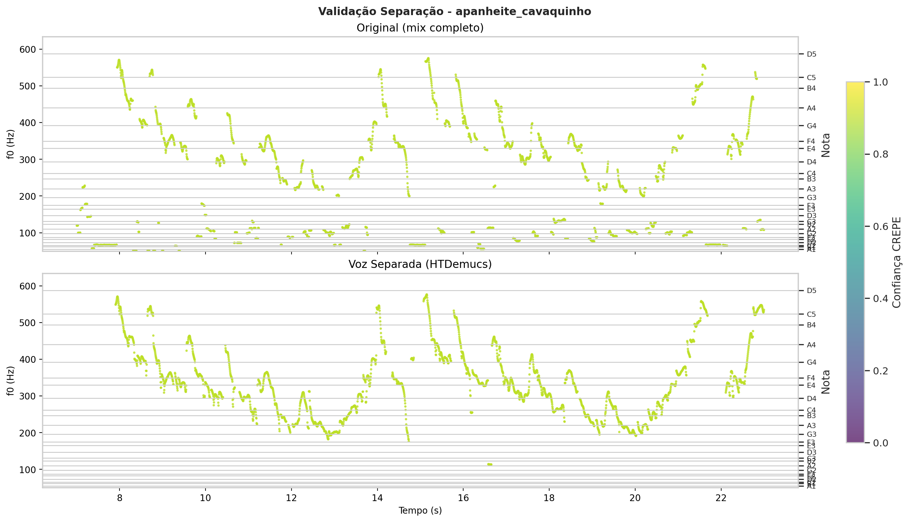
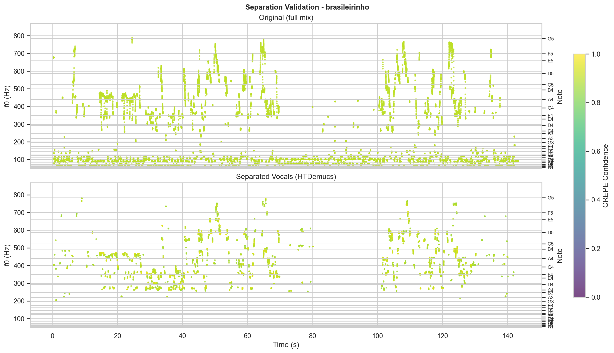
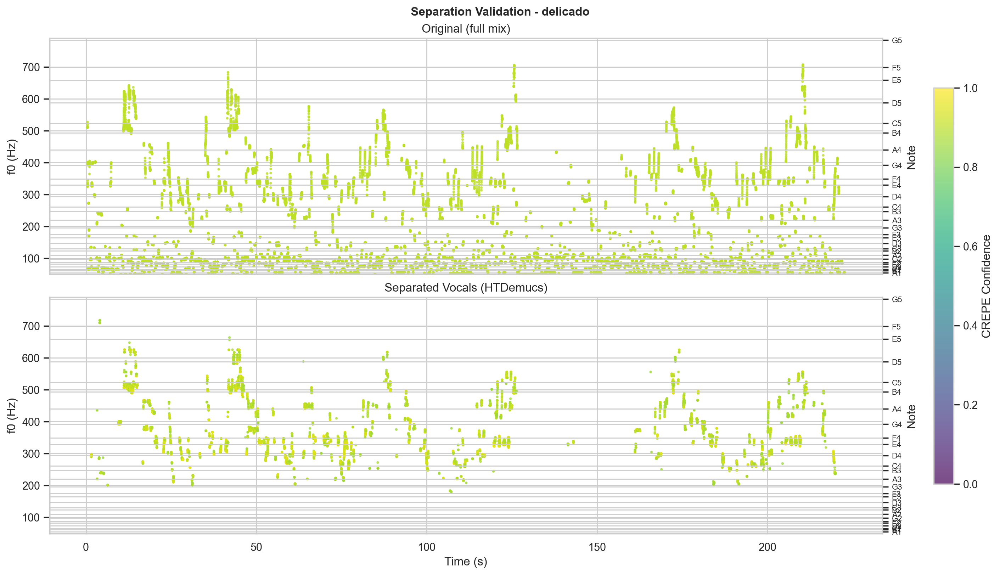

# Análise Bioacústica - Ademilde Fonseca

*Relatório gerado com auxílio de IA (Gemini 2.0 Flash)*

*Análise multimodal com 12 visualizações*

---

## Análise Bioacústica da Voz de Ademilde Fonseca e Implicações para a Classificação Vocal Tradicional

Este artigo apresenta uma análise da voz de Ademilde Fonseca, renomada cantora brasileira de choro, com o objetivo de examinar a validade do sistema de classificação vocal "Fach" à luz de dados fisiológicos. Através da extração de parâmetros acústicos e da identificação dos mecanismos laríngeos predominantes (M1/M2), buscamos fornecer uma descrição mais detalhada e precisa do perfil vocal da artista, desafiando as categorias fixas do sistema tradicional.

### 1. Caracterização Vocal

A voz de Ademilde Fonseca demonstra uma extensão vocal notável, abrangendo de C#3 (136.0 Hz) a G5 (784.0 Hz), com uma f0 média de 396.4 Hz (G4). Essa extensão, aliada a um HNR médio de 16.7 dB, sugere uma voz com boa projeção e clareza. No entanto, os valores de Jitter (1.020%) e Shimmer (9.220%) indicam uma certa instabilidade vocal, possivelmente inerente ao estilo interpretativo da cantora e às técnicas de ornamentação características do choro. Observando [apanheite_cavaquinho_f0](plots/apanheite_cavaquinho_f0.png), notamos uma riqueza de ornamentação e vibrato, que podem contribuir para os valores de instabilidade. As médias globais dos formantes (F1: 660.1 Hz, F2: 1629.0 Hz, F3: 2802.4 Hz, F4: 3803.3 Hz) fornecem informações sobre a qualidade timbral da voz, que merece uma análise mais aprofundada em relação às vogais cantadas.

### 2. Análise de Mecanismos Laríngeos

A análise dos mecanismos laríngeos revela que Ademilde Fonseca utiliza tanto o mecanismo M1 (voz de peito) quanto o M2 (voz de cabeça) de forma expressiva. M1 é utilizado em 56.3% dos frames, com uma f0 média de 314.6 Hz (D#4) e uma extensão de C#3 a G4. M2 é utilizado em 43.7% dos frames, com uma f0 média de 502.0 Hz (B4) e uma extensão de G4 a G5. Essa distribuição equilibrada sugere um controle vocal apurado e a habilidade de transitar entre os registros com fluidez. A análise de clusters em [mechanism_clusters](plots/mechanism_clusters.png) demonstra uma separação clara entre os clusters correspondentes aos mecanismos M1 e M2, com base nos parâmetros de f0 e HNR. Visualizando [xgb_mechanism_timeline](plots/xgb_mechanism_timeline.png), é possível observar como a cantora alterna entre os mecanismos laríngeos ao longo das músicas, explorando diferentes regiões da sua tessitura e expressando nuances emocionais.

### 3. Implicações para o Sistema Fach

Os dados apresentados desafiam a rigidez do sistema "Fach", que busca classificar vozes em categorias predefinidas com base na extensão e tessitura. A habilidade de Ademilde Fonseca de utilizar ambos os mecanismos laríngeos em uma ampla extensão vocal, transitando entre eles com frequência, torna difícil encaixá-la em uma categoria específica. O sistema "Fach" tradicionalmente valoriza a homogeneidade vocal dentro de uma região específica, enquanto a expressividade de Ademilde Fonseca reside justamente na sua capacidade de explorar diferentes registros e qualidades vocais. O [mechanism_analysis](plots/mechanism_analysis.png) apresenta histogramas que mostram a distribuição de f0 para M1 e M2, revelando uma sobreposição considerável, o que dificulta a atribuição a uma única categoria.

### 4. Limitações

É importante reconhecer as limitações desta análise. As gravações de Ademilde Fonseca são históricas e podem apresentar ruídos e variações na qualidade do áudio, o que pode influenciar a precisão da extração de parâmetros acústicos. Além disso, a identificação dos mecanismos laríngeos foi realizada de forma automática, e embora a validação visual, como em [delicado_separation_validation](plots/delicado_separation_validation.png), mostre resultados promissores, ela não substitui a análise laringoscópica direta. Estudos futuros poderiam se beneficiar da análise de um conjunto maior de gravações e da inclusão de outros parâmetros acústicos, como a intensidade e a duração das notas, para uma caracterização vocal ainda mais completa.


---

## Figuras

### apanheite_cavaquinho_f0


*Contorno de f0 - apanheite_cavaquinho*

### apanheite_cavaquinho_separation_validation



*apanheite_cavaquinho_separation_validation*

### brasileirinho_f0


*Contorno de f0 - brasileirinho*

### brasileirinho_separation_validation



*brasileirinho_separation_validation*

### delicado_f0


*Contorno de f0 - delicado*

### delicado_separation_validation



*delicado_separation_validation*

### excerpt_apanheite_cavaquinho


*excerpt_apanheite_cavaquinho*

### excerpt_brasileirinho


*excerpt_brasileirinho*

### excerpt_delicado


*excerpt_delicado*

### mechanism_analysis


*Análise de mecanismos M1/M2 (histograma, scatter, boxplot, temporal)*

### mechanism_clusters


*Clustering GMM dos mecanismos laríngeos*

### xgb_mechanism_timeline


*xgb_mechanism_timeline*


---

## Dados Brutos

```json
{
  "stats": {
    "M1": {
      "count": 13593,
      "f0_mean": 314.5957586750534,
      "f0_std": 49.51531625496095,
      "f0_min": 136.03787,
      "f0_max": 399.70486,
      "hnr_mean": 16.685550698244285,
      "note_mean": "D#4",
      "note_range": "C#3 – G4"
    },
    "M2": {
      "count": 10531,
      "f0_mean": 502.0288181711138,
      "f0_std": 75.55221292925948,
      "f0_min": 403.05273,
      "f0_max": 784.00336,
      "hnr_mean": 16.71139469272848,
      "note_mean": "B4",
      "note_range": "G4 – G5"
    }
  },
  "global": {
    "total_voiced_frames": 24124,
    "f0_mean_hz": 396.3999938964844,
    "f0_mean_note": "G4",
    "f0_min_hz": 136.0,
    "f0_max_hz": 784.0,
    "f0_range_notes": "C#3 – G5",
    "f0_std_hz": 111.9,
    "hnr_mean_db": 16.7
  }
}
```
