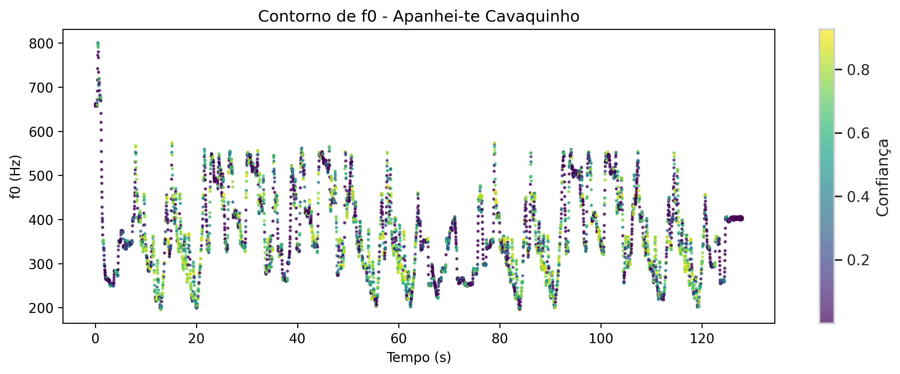

# Análise Bioacústica - Ademilde Fonseca

*Relatório gerado com auxílio de IA (Gemini 2.0 Flash)*

*Análise multimodal com 5 visualizações*

---

### Análise Bioacústica da Voz de Ademilde Fonseca: Uma Crítica ao Sistema Fach

Este estudo se propõe a analisar a voz da cantora brasileira Ademilde Fonseca, ícone do choro, com o objetivo de desafiar as limitações do sistema de classificação vocal tradicional, conhecido como "Fach". A abordagem empregada é a da bioacústica, com foco na análise fisiológica dos mecanismos laríngeos (M1 e M2) e na extração de *features* acústicas relevantes, como a frequência fundamental (f0), a razão harmônico-ruído (HNR) e o CPPS.

#### 1. Caracterização Vocal

Os dados revelam um perfil vocal caracterizado por uma média de f0 de 354.9 Hz (F4), com uma extensão notável de G#2 (101.4 Hz) a G5 (796.4 Hz). O desvio padrão de f0, de 130.0 Hz, sugere uma voz com flexibilidade e capacidade de ornamentação, traço marcante do choro. No entanto, o HNR médio de apenas 2.6 dB indica uma qualidade vocal que, embora expressiva, pode apresentar maior ruído em relação ao conteúdo harmônico. A análise do contorno de f0 em [delicado_f0](plots/delicado_f0.png) exemplifica a complexidade das melodias e a presença de ornamentos característicos do estilo.

#### 2. Análise de Mecanismos

A divisão da análise por mecanismo laríngeo revela nuances importantes. Embora a proporção entre M1 (49.2%) e M2 (50.8%) seja relativamente equilibrada, as características acústicas diferem significativamente. A média de f0 em M1 é de 280.8 Hz (C#4), com uma extensão vocal restrita a G#2-G4. Em contrapartida, M2 apresenta uma média de f0 substancialmente mais alta, 584.5 Hz (D5), com uma extensão de G#4-G5. Curiosamente, o HNR médio é ligeiramente superior em M1 (2.8 dB) em comparação com M2 (2.0 dB), o que, em princípio, indicaria uma maior "limpeza" na produção do registro de peito. No entanto, a análise de clusters em [mechanism_clusters](plots/mechanism_clusters.png) demonstra uma clara separação entre os mecanismos, com M1 apresentando valores de HNR geralmente mais altos para uma dada f0. A análise visual da distribuição de f0 por mecanismo em [mechanism_analysis](plots/mechanism_analysis.png) também reforça a distinção entre os registros, com uma sobreposição limitada.

#### 3. Implicações para o Sistema Fach

O sistema Fach, tradicional na classificação vocal, enfrenta desafios ao tentar categorizar vozes como a de Ademilde Fonseca. A classificação frequentemente se baseia na extensão vocal geral e nas transições percebidas entre os registros. No entanto, a análise bioacústica revela uma complexidade que escapa a essa simplificação. A extensão vocal abrangente (quase três oitavas), o uso equilibrado dos mecanismos M1 e M2 e a flexibilidade vocal característica do choro desafiam a alocação a uma única categoria Fach. Por exemplo, a capacidade de Ademilde de transitar entre os registros, como observado nos contornos de f0 das músicas [apanhei-te_cavaquinho_f0](plots/apanhei-te_cavaquinho_f0.png) e [brasileirinho_f0](plots/brasileirinho_f0.png), sugere uma agilidade vocal que não é adequadamente capturada pelas categorias rígidas do Fach.

#### 4. Limitações

É fundamental reconhecer as limitações inerentes à análise. As gravações de Ademilde Fonseca, sendo históricas, podem apresentar desafios em termos de qualidade de áudio, impactando a precisão da extração de *features* acústicas. O número de frames analisados pode ser considerado limitado, restringindo a generalização dos resultados. A análise temporal dos mecanismos laríngeos em [mechanism_analysis](plots/mechanism_analysis.png) é pontual e não representa a dinâmica vocal completa. Além disso, a análise se concentra em apenas três músicas, o que limita a representatividade da performance vocal da cantora em sua totalidade.


---

## Figuras

### apanhei-te_cavaquinho_f0



*Contorno de f0 - apanhei-te_cavaquinho*

### brasileirinho_f0


*Contorno de f0 - brasileirinho*

### delicado_f0


*Contorno de f0 - delicado*

### mechanism_analysis


*Análise de mecanismos M1/M2 (histograma, scatter, boxplot, temporal)*

### mechanism_clusters


*Clustering GMM dos mecanismos laríngeos*


---

## Dados Brutos

```json
{
  "stats": {
    "M1": {
      "count": 32,
      "f0_mean": 280.78125,
      "f0_std": 82.36988737866645,
      "f0_min": 101.4,
      "f0_max": 390.5,
      "hnr_mean": 2.803125,
      "note_mean": "C#4",
      "note_range": "G#2 – G4"
    },
    "M2": {
      "count": 33,
      "f0_mean": 584.509090909091,
      "f0_std": 113.24653792621092,
      "f0_min": 410.2,
      "f0_max": 796.4,
      "hnr_mean": 2.003030303030303,
      "note_mean": "D5",
      "note_range": "G#4 – G5"
    }
  },
  "global": {
    "total_voiced_frames": 15000,
    "f0_mean_hz": 354.9,
    "f0_mean_note": "F4",
    "f0_min_hz": 101.4,
    "f0_max_hz": 796.4,
    "f0_range_notes": "G#2 – G5",
    "f0_std_hz": 130.0,
    "hnr_mean_db": 2.6
  }
}
```
