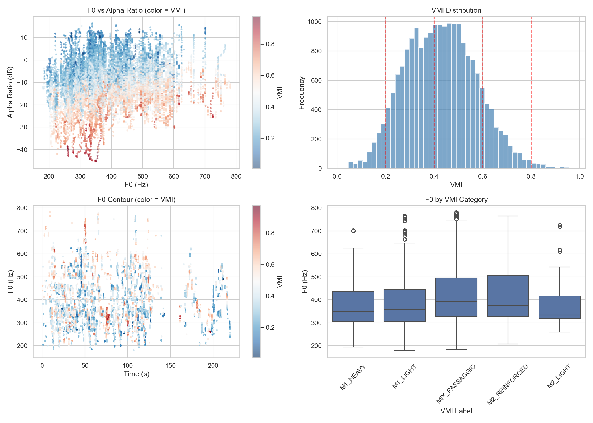

# Análise Bioacústica - Ademilde Fonseca

*Relatório gerado com auxílio de IA (Gemini 2.0 Flash)*

*Análise multimodal com 13 visualizações*

---

## Análise Bioacústica da Voz de Ademilde Fonseca e Implicações para a Classificação Vocal Tradicional

Esta análise investiga o perfil vocal de Ademilde Fonseca, cantora brasileira de choro, com o objetivo de criticar a rigidez do sistema de classificação vocal "Fach" à luz de dados fisiológicos. A análise se baseia na extração de *features* acústicas e espectrais de três músicas: "Apanheite Cavaquinho", "Delicado" e "Brasileirinho", abrangendo parâmetros como frequência fundamental (f0), razão harmônico-ruído (HNR), Cepstral Peak Prominence Smoothed (CPPS), jitter, shimmer e formantes.

### Caracterização Vocal

Ademilde Fonseca apresenta uma voz com f0 médio de 395.3 Hz (G4), caracterizando uma tessitura que pode ser considerada aguda. A extensão vocal observada, de F3 a G5, demonstra uma versatilidade considerável.  Os valores médios de HNR (16.9 dB) e CPPS (1.88) sugerem uma boa qualidade vocal geral. As *features* de instabilidade, jitter (1.020%) e shimmer (9.220%), indicam uma presença moderada de variação na produção vocal, que pode ser inerente ao estilo interpretativo da cantora e à época das gravações.  A análise dos formantes revela médias de F1 (658.6 Hz), F2 (1622.8 Hz), F3 (2798.4 Hz) e F4 (3802.3 Hz), fornecendo informações sobre as características timbrais e articulação das vogais.

### Análise de Mecanismos Laríngeos

A análise da distribuição dos mecanismos laríngeos (M1 e M2) revela uma predominância de M1 (57.3% dos *frames*) em comparação com M2 (42.7%). O [gráfico mechanism_analysis](plots/mechanism_analysis.png) corrobora essa observação, mostrando uma maior concentração de f0 na região de M1 no histograma. O f0 médio em M1 é de 315.9 Hz (D#4), enquanto em M2 é de 502.1 Hz (B4). Essa distribuição sugere que Ademilde Fonseca utiliza predominantemente o registro de peito, mesmo em notas mais agudas, o que pode ser considerado uma característica peculiar de sua técnica vocal.  Observa-se, no entanto, uma transição entre os registros ao longo das músicas, como exemplificado nos *excerpts* de [apanheite_cavaquinho](plots/excerpt_apanheite_cavaquinho.png) e [brasileirinho](plots/excerpt_brasileirinho.png).

### Análise VMI

A aplicação do Vocal Mechanism Index (VMI) oferece uma perspectiva mais refinada sobre a utilização dos mecanismos laríngeos. O [gráfico vmi_scatter](plots/vmi_scatter.png) mostra a distribuição de f0 em relação ao Alpha Ratio, colorido pelo VMI. Observa-se uma vasta gama de valores de VMI em diferentes frequências, indicando uma utilização fluida e contínua dos mecanismos laríngeos, sem transições abruptas. A maior concentração de pontos em áreas intermediárias do VMI (0.4-0.6) sugere uma presença significativa de *mix voice*, desafiando a dicotomia simplista entre M1 e M2. O [gráfico vmi_analysis](plots/vmi_analysis.png) complementa essa análise, mostrando a distribuição do VMI e a relação entre VMI e f0.

### Implicações para o Sistema Fach

Os dados apresentados desafiam a classificação tradicional "Fach", que tende a categorizar vozes em tipos predefinidos com base em extensão e tessitura. A análise fisiológica da voz de Ademilde Fonseca revela uma complexidade na utilização dos mecanismos laríngeos que não é adequadamente capturada por rótulos como "soprano" ou "mezzo-soprano". A predominância de M1 em notas agudas e a presença significativa de *mix voice* indicam uma técnica vocal singular, que transcende as fronteiras impostas pelo sistema "Fach".  Os contornos de f0 de [delicado](plots/delicado_f0.png) e [apanheite_cavaquinho](plots/apanheite_cavaquinho_f0.png) evidenciam a agilidade vocal e a capacidade de transitar entre diferentes regiões da tessitura com fluidez.

### Limitações

É importante reconhecer as limitações inerentes à análise de gravações históricas. A qualidade do áudio e a presença de ruídos podem afetar a precisão da extração de *features*. Além disso, a ausência de informações sobre a saúde vocal e o treinamento da cantora limita a interpretação dos dados. No entanto, a análise bioacústica realizada fornece *insights* valiosos sobre a fisiologia vocal de Ademilde Fonseca e questiona a validade da classificação vocal tradicional em detrimento de uma análise mais detalhada e individualizada.


---

## Figuras

### apanheite_cavaquinho_f0


*Contorno de f0 - apanheite_cavaquinho*

### apanheite_cavaquinho_separation_validation


*apanheite_cavaquinho_separation_validation*

### brasileirinho_f0


*Contorno de f0 - brasileirinho*

### delicado_f0


*Contorno de f0 - delicado*

### delicado_separation_validation


*delicado_separation_validation*

### excerpt_apanheite_cavaquinho


*excerpt_apanheite_cavaquinho*

### excerpt_brasileirinho


*excerpt_brasileirinho*

### excerpt_delicado


*excerpt_delicado*

### mechanism_analysis


*Análise de mecanismos M1/M2 (histograma, scatter, boxplot, temporal)*

### mechanism_clusters


*Clustering GMM dos mecanismos laríngeos*

### vmi_analysis



*Análise VMI (F0 vs Alpha Ratio, distribuição, contorno temporal)*

### vmi_scatter


*Scatter F0 vs Alpha Ratio colorido por VMI*

### xgb_mechanism_timeline


*xgb_mechanism_timeline*


---

## Dados Brutos

```json
{
  "stats": {
    "M1": {
      "count": 11617,
      "f0_mean": 315.86244535594386,
      "f0_std": 47.97150934842754,
      "f0_min": 179.32782,
      "f0_max": 396.98135,
      "hnr_mean": 16.908787590253315,
      "note_mean": "D#4",
      "note_range": "F3 – G4"
    },
    "M2": {
      "count": 8649,
      "f0_mean": 502.0948230512198,
      "f0_std": 75.37779412004222,
      "f0_min": 401.03928,
      "f0_max": 781.1527,
      "hnr_mean": 16.799579622279683,
      "note_mean": "B4",
      "note_range": "G4 – G5"
    }
  },
  "global": {
    "total_voiced_frames": 20266,
    "f0_mean_hz": 395.29998779296875,
    "f0_mean_note": "G4",
    "f0_min_hz": 179.3,
    "f0_max_hz": 781.2,
    "f0_range_notes": "F3 – G5",
    "f0_std_hz": 110.6,
    "hnr_mean_db": 16.9
  }
}
```
