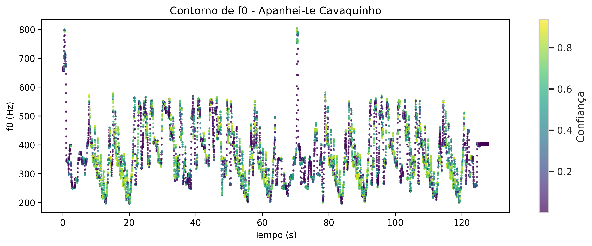
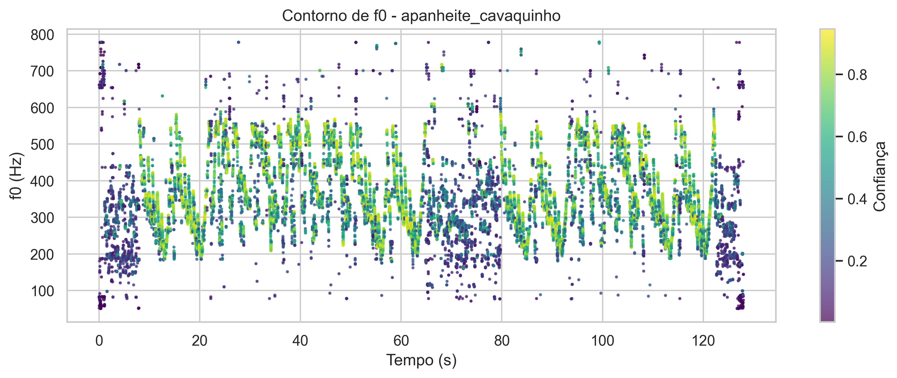
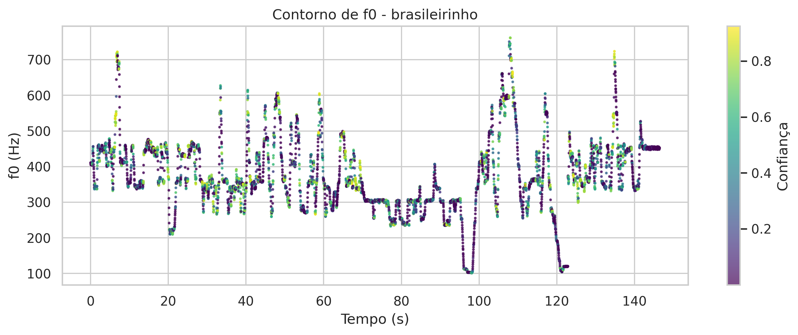
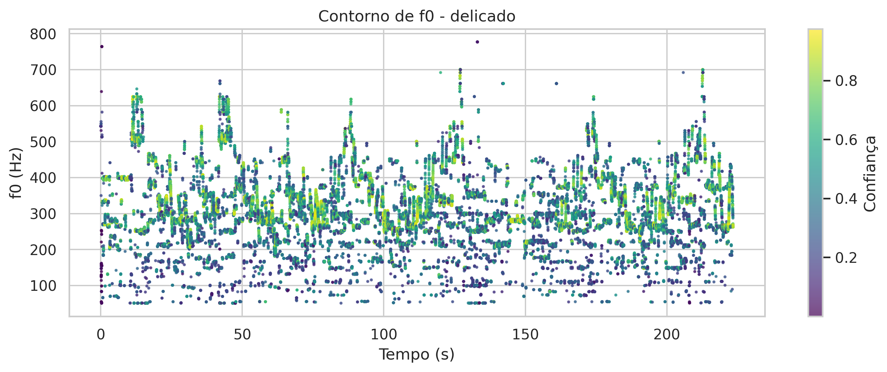
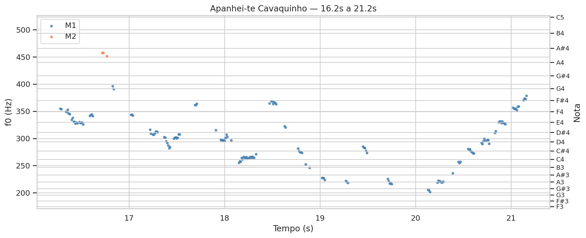
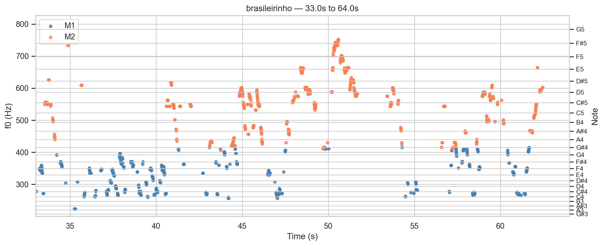
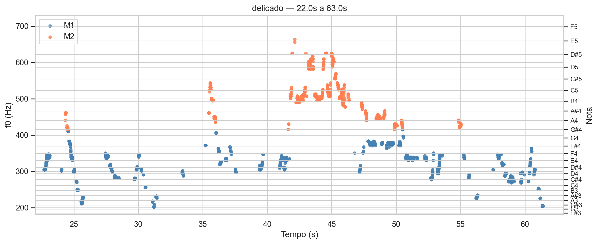
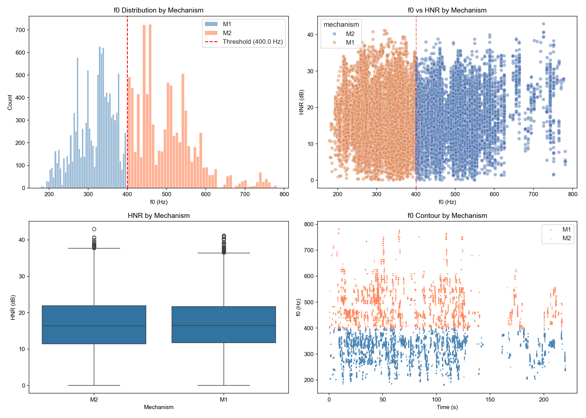
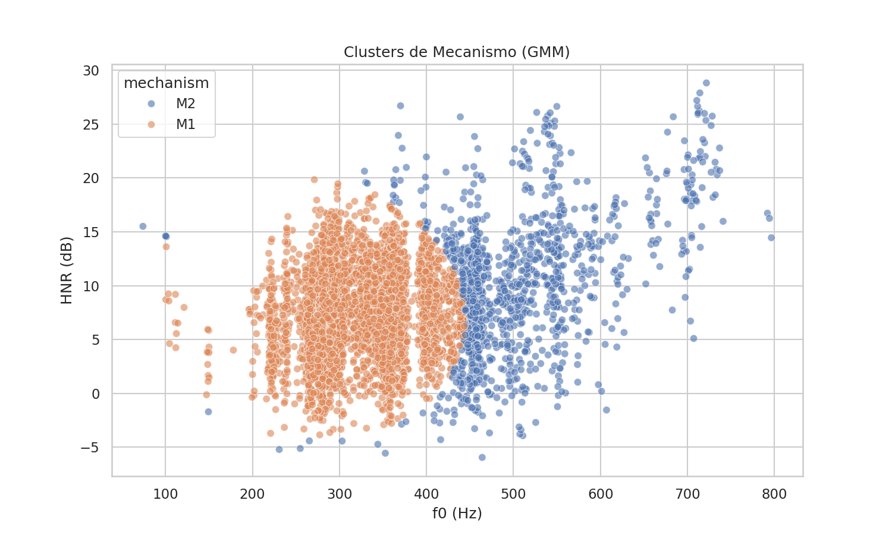
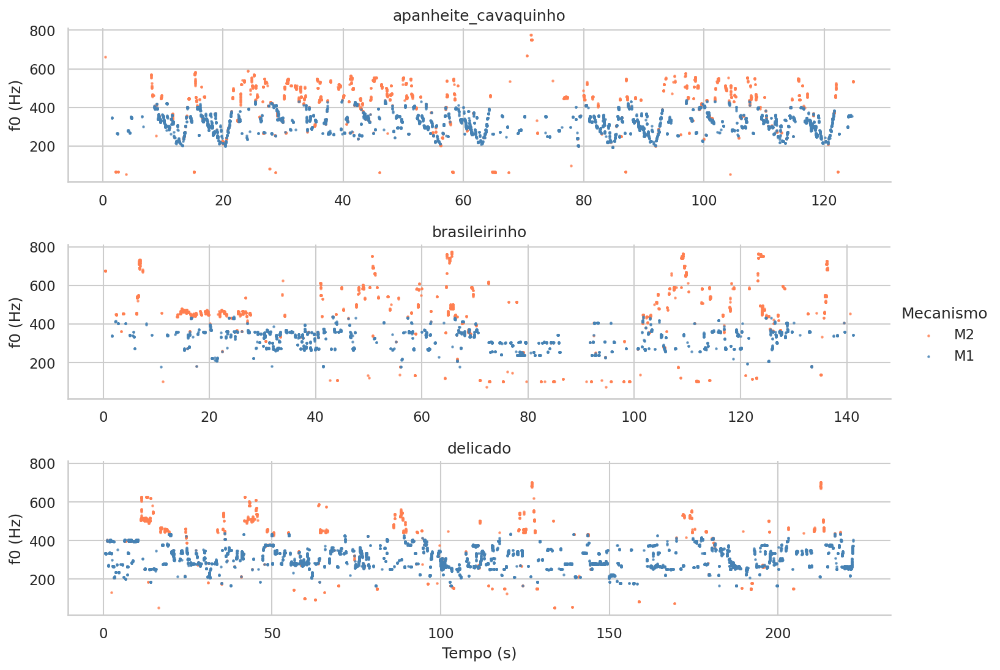

# Análise Bioacústica - Ademilde Fonseca

*Relatório gerado com auxílio de IA (Gemini 2.0 Flash)*

*Análise multimodal com 11 visualizações*

---

## Análise Bioacústica e Fisiológica da Voz de Ademilde Fonseca: Implicações para a Classificação Vocal

Esta análise investiga a voz da cantora brasileira Ademilde Fonseca, pioneira no choro vocal, através de parâmetros bioacústicos e fisiológicos. Nosso objetivo é oferecer uma caracterização detalhada de seu estilo vocal e discutir as limitações do sistema de classificação vocal "Fach" à luz de seus dados.

### 1. Caracterização Vocal

Ademilde Fonseca apresenta uma extensão vocal notável, abrangendo de G1 (50.0 Hz) a G5 (797.6 Hz), com uma f0 média de 182.3 Hz (F#3). Essa extensão, por si só, já sugere uma voz com agilidade e flexibilidade consideráveis. A análise da f0 em [delicado_f0](plots/delicado_f0.png), por exemplo, demonstra a rápida movimentação melódica típica do choro. No entanto, a voz de Ademilde Fonseca revela-se complexa. Apesar da ampla tessitura, o HNR médio global é relativamente baixo (5.3 dB), assim como o CPPS médio (-8.39), indicando uma qualidade vocal com maior presença de ruído. Os valores de Jitter (2.117%) e Shimmer (15.613%) também apontam para uma instabilidade considerável na produção vocal, o que pode ser atribuído a escolhas estilísticas e/ou características das gravações históricas. As médias globais dos formantes (F1: 684.6 Hz, F2: 1633.3 Hz, F3: 2745.4 Hz, F4: 3886.4 Hz) fornecem informações sobre as características ressonantais de seu trato vocal, com valores que refletem uma produção vocal clara e distinta.

### 2. Análise de Mecanismos Laríngeos

A análise dos mecanismos laríngeos (M1 e M2) revela uma predominância do mecanismo M1, correspondendo a 87.8% dos frames analisados.  O histograma da distribuição de f0 por mecanismo em [mechanism_analysis](plots/mechanism_analysis.png) exibe claramente essa preponderância de M1. A f0 média em M1 é de 137.4 Hz (C#3), enquanto em M2 é de 506.9 Hz (B4). Apesar da maior utilização de M1, Ademilde Fonseca demonstra capacidade de acessar a região aguda com M2, cobrindo uma extensão de G4 a G5. Curiosamente, o HNR médio em M2 (8.0 dB) é superior ao de M1 (4.9 dB), sugerindo uma produção mais "limpa" quando utiliza o registro de cabeça. Os gráficos [excerpt_apanheite_cavaquinho](plots/excerpt_apanheite_cavaquinho.png) e [excerpt_brasileirinho](plots/excerpt_brasileirinho.png) ilustram passagens em que a cantora alterna entre os mecanismos, demonstrando controle e agilidade vocal. A análise de clusters em [mechanism_clusters](plots/mechanism_clusters.png) reforça a distinção entre os dois mecanismos, com agrupamentos bem definidos em função de f0 e HNR.

### 3. Implicações para o Sistema Fach

Os dados obtidos desafiam a aplicação direta do sistema "Fach". A classificação tradicional de uma cantora com essa extensão e agilidade poderia levá-la a ser rotulada como soprano leggero ou coloratura. No entanto, a predominância de M1 e os valores de HNR indicam uma voz que, embora alcance notas agudas, possui uma qualidade timbral mais rica e "aterrada" do que se esperaria de uma soprano tipicamente classificada pelo sistema Fach. Ademilde Fonseca utiliza M2 como ferramenta para ornamentação e passagens específicas, mas sua base vocal está firmemente estabelecida em M1, conferindo-lhe um timbre particular e identificável. A análise da timeline com a predição do mecanismo em [xgb_mechanism_timeline](plots/xgb_mechanism_timeline.png) ilustra claramente as alternâncias entre os mecanismos, especialmente nas passagens mais ornamentadas. Portanto, a voz de Ademilde Fonseca demonstra a insuficiência do sistema "Fach" em capturar as nuances e a complexidade de vozes que transcendem as categorias predefinidas.

### 4. Limitações

É importante reconhecer as limitações inerentes à análise de gravações históricas. A qualidade sonora das gravações de Ademilde Fonseca pode influenciar os valores de HNR, Jitter e Shimmer. Além disso, a análise dos mecanismos laríngeos é baseada em modelos computacionais e algoritmos de processamento de sinal, sujeitos a erros de segmentação e classificação. No entanto, mesmo com essas ressalvas, os dados obtidos fornecem *insights* valiosos sobre a fisiologia vocal e o estilo único de Ademilde Fonseca, evidenciando a necessidade de abordagens mais flexíveis e individualizadas na classificação vocal.


---

## Figuras

### apanhei-te_Cavaquinho_f0



*Contorno de f0 - apanhei-te_Cavaquinho*

### apanheite_cavaquinho_f0



*Contorno de f0 - apanheite_cavaquinho*

### brasileirinho_f0



*Contorno de f0 - brasileirinho*

### delicado_f0



*Contorno de f0 - delicado*

### excerpt_Apanhei-te_Cavaquinho



*excerpt_Apanhei-te_Cavaquinho*

### excerpt_apanheite_cavaquinho


*excerpt_apanheite_cavaquinho*

### excerpt_brasileirinho



*excerpt_brasileirinho*

### excerpt_delicado



*excerpt_delicado*

### mechanism_analysis



*Análise de mecanismos M1/M2 (histograma, scatter, boxplot, temporal)*

### mechanism_clusters



*Clustering GMM dos mecanismos laríngeos*

### xgb_mechanism_timeline



*xgb_mechanism_timeline*


---

## Dados Brutos

```json
{
  "stats": {
    "M1": {
      "count": 73471,
      "f0_mean": 137.37302483711954,
      "f0_std": 98.45167781541869,
      "f0_min": 49.97211369378783,
      "f0_max": 399.9923595069903,
      "hnr_mean": 4.8969463321116615,
      "note_mean": "C#3",
      "note_range": "G1 – G4"
    },
    "M2": {
      "count": 10165,
      "f0_mean": 506.9154960342037,
      "f0_std": 82.93479915161907,
      "f0_min": 400.0027853688515,
      "f0_max": 797.6136807314264,
      "hnr_mean": 8.032747127595341,
      "note_mean": "B4",
      "note_range": "G4 – G5"
    }
  },
  "global": {
    "total_voiced_frames": 83636,
    "f0_mean_hz": 182.3,
    "f0_mean_note": "F#3",
    "f0_min_hz": 50.0,
    "f0_max_hz": 797.6,
    "f0_range_notes": "G1 – G5",
    "f0_std_hz": 154.7,
    "hnr_mean_db": 5.3
  }
}
```
